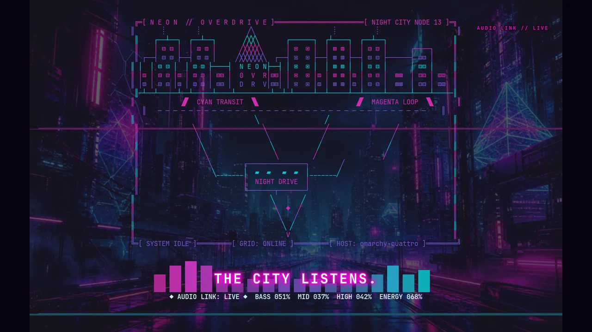

# Neon Overdrive for Omarchy

[](https://github.com/0xsl0th/omarchy-neon-overdrive-screensaver/raw/refs/heads/main/promo/neon-overdrive-promo-github.mp4)

[Watch the 32-second preview with sound](https://github.com/0xsl0th/omarchy-neon-overdrive-screensaver/raw/refs/heads/main/promo/neon-overdrive-promo-github.mp4)

Neon Overdrive is a multi-monitor animated screensaver for Omarchy Quattro. It
cycles through Synth Grid, Laser Etch, Matrix Rain, VHS Distortion, and
Thunderstorm in a cyan-and-magenta night-city palette. When music is playing,
it can switch automatically to a live Cava spectrum that makes the skyline,
glow, and bass pulse together.

## Install

```bash
omarchy plugin add https://github.com/0xsl0th/omarchy-neon-overdrive-screensaver.git --enable
```

That command clones, validates, and enables the plugin. Neon Overdrive provides
both an overlay entry point and the idle service, so enabling it replaces the
stock `omarchy.idle` service. Disabling or removing it restores the stock
service automatically.

Plugins run as unsandboxed code inside the long-lived Omarchy shell. Review the
repository before enabling it.

## Requirements

- Omarchy Quattro with its Quickshell plugin manager and a Hyprland session
- `ttfx` 0.3.2 or newer
- `bash`, `jq`, `socat`, `procps-ng`, and `xdg-terminal-exec`
- Alacritty, Foot, Ghostty, or Kitty as the selected terminal
- Optional: Cava 0.10.7 or newer for music-reactive mode

The tested baseline is Omarchy `4.0.0.r1836.g0ae1694-1`, Hyprland 0.56.2,
TTFX 0.3.2, and Cava 0.10.7. Direct Git installation does not run dependency
hooks. Install the optional visualizer through Omarchy:

```bash
omarchy pkg add cava
```

## Use

Once enabled, the screensaver follows the `idle.screensaver` and `idle.lock`
timers in `~/.config/omarchy/shell.json`. Keyboard input, mouse input, or focus
loss dismisses every screensaver window. Omarchy's Stay Awake control pauses
the idle service as usual.

Preview the default rotation immediately through the overlay entry point:

```bash
omarchy-shell shell summon io.github.0xsl0th.neon-overdrive '{}'
```

Choose an effect by passing a JSON payload:

```bash
omarchy-shell shell summon io.github.0xsl0th.neon-overdrive '{"effect":"laseretch"}'
```

Supported values are `rotate`, `random`, `synthgrid`, `laseretch`, `matrix`,
`vhstape`, and `thunderstorm`. The launcher can also be called directly:

```bash
"$HOME/.config/omarchy/plugins/io.github.0xsl0th.neon-overdrive/bin/neon-overdrive-launch" force --effect rotate
```

### Optional Omarchy menu shortcuts

The direct plugin command above is the complete installation. To additionally
add managed menu shortcuts for every effect, run:

```bash
"$HOME/.config/omarchy/plugins/io.github.0xsl0th.neon-overdrive/install.sh" --activate-only
```

The helper adds one marker-delimited block to the existing menu. It does not
replace `shell.json` or the full menu file, and rerunning it is idempotent.

### Music-reactive mode

The renderer starts Cava as an optional child process with an isolated config.
It analyzes the current default PipeWire output in memory and sends only
derived frequency magnitudes to the renderer; it does not save or transmit
audio. Silence, a stalled stream, or a Cava failure returns the screensaver to
its normal effect sequence. Each monitor owns its Cava process and terminates
that exact PID on exit, leaving unrelated visualizers alone.

Set `NEON_OVERDRIVE_AUDIO=off` in the graphical session environment to disable
audio detection. To use another reviewed Cava input configuration, set
`NEON_OVERDRIVE_CAVA_CONFIG=/path/to/config`.

## Update

```bash
omarchy plugin update io.github.0xsl0th.neon-overdrive --yes
```

If you installed the optional menu block, rerun `install.sh --activate-only`
after updating.

## Remove

For a direct installation:

```bash
omarchy plugin remove io.github.0xsl0th.neon-overdrive --yes
```

If you installed the optional menu block, use the bundled helper so it removes
that block before removing the plugin:

```bash
"$HOME/.config/omarchy/plugins/io.github.0xsl0th.neon-overdrive/uninstall.sh"
```

If the replacement service ever fails to load, recover the stock service with:

```bash
omarchy plugin disable io.github.0xsl0th.neon-overdrive
omarchy restart shell
```

## Validate locally

```bash
omarchy plugin validate .
./scripts/validate.sh
```

The project validator is offline-safe and does not touch live configuration.
It checks the manifest, shell syntax, required publishing assets, symlinks,
machine-specific strings, idle-model behavior, audio parsing, renderer handoff,
menu idempotence, exact menu removal, and whitespace errors.

## Repository layout

```text
manifest.json                         Omarchy plugin metadata
Plugin.qml                            Standard overlay/summon entry point
Service.qml                           Idle and lock lifecycle service
IdleModel.js                          Pure idle/event helpers
preview.webp                          Repository preview image
promo/neon-overdrive-promo-github.mp4 32-second web preview
assets/cava-reactive.conf             Isolated Cava configuration
assets/screensaver.txt                Terminal artwork
bin/neon-overdrive-launch             Multi-monitor terminal launcher
bin/neon-overdrive-render             TTFX/audio renderer and wake handling
scripts/menu-integration.sh           Optional managed menu integration
scripts/validate.sh                   Offline-safe validation suite
```

## License and provenance

The original code and artwork are distributed under the [MIT License](LICENSE).
The idle implementation is derived from Omarchy's built-in idle plugin; its
MIT notice is preserved in [LICENSES/Omarchy-MIT.txt](LICENSES/Omarchy-MIT.txt).
See [NOTICE.md](NOTICE.md) for the promotional soundtrack terms.
